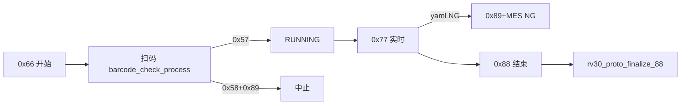

# RV30 基站成品治具 — 函数参考手册

> **用途**：供开发/联调/AI 快速查阅 RV30（`device_type=50`）相关函数、参数、返回值与调用关系。  
> **代码锚点**：`test_tool/test.py`（`# #[RV30-PROTO]` 标记）、`ui/MainFrame.py`（`rv30_item_result`）  
> **协议规格**：[`RV30_BASESTATION_PROTOCOL_AND_IMPLEMENTATION_SPEC.md`](./RV30_BASESTATION_PROTOCOL_AND_IMPLEMENTATION_SPEC.md)  
> **权威字段布局**：`doc/通讯协议.png`、`doc/MES协议.csv`

---

## 1. 架构概览



| 环节 | 入口位置 | 说明 |
|------|----------|------|
| 串口分发 | `test_cmd_handle` → `dev==50` | 帧内设备字节 `50` 或 `0x50` 均视为 RV30 |
| 命令处理 | `RV30_finished_product_mode(dev, cmd, dat)` | 主调优入口 |
| 扫码门闸 | `barcode_check_process()`，`load_cfg.dev==50` | 成功 `0x57`，失败 `0x58`+`0x89` |
| 配置阈值 | `load_config()` + `config.yaml` 的 `rv30_*` | 全 `0` 表示该项不参与比较 |
| 动态阈值 | `rv30_proto_parse_68_dat` | 治具 `0x68` 覆盖运行时 `load_cfg.rv30_*`（**当前主流程未挂接 0x68**） |

---

## 2. 模块级常量与全局状态

### 2.1 会话状态机

| 常量 | 值 | 含义 |
|------|-----|------|
| `RV30_SESS_IDLE` | 0 | 空闲，可接受新一轮 `0x66` |
| `RV30_SESS_WAIT_SN` | 1 | 已收 `0x66`，等待扫码 |
| `RV30_SESS_RUNNING` | 2 | 已发 `0x57`，处理 `0x77` |
| `RV30_SESS_FINISHED` | 3 | 本轮正常收尾 |
| `RV30_SESS_ABORTED` | 4 | 异常/NG 收尾 |

### 2.2 全局变量

| 变量 | 类型 | 含义 |
|------|------|------|
| `rv30_session_state` | int | 当前会话状态 |
| `rv30_last_step` | int | 上一帧治具步骤号（`-1` 表示尚无） |
| `rv30_max_step` | int | 本轮收到的最大步骤（终判要求 `>= 4`） |
| `rv30_89_mes_done` | bool | 是否已上报 MES NG（防抖，避免重复 `send_report`） |
| `rv30_realtime_ng` | bool | 实时阶段是否已判 NG |
| `rv30_last_p` | dict \| None | 最近一帧 `0x77` 解析结果 |
| `rv30_last_dust_notify` | int | 尘袋步骤 3 顶部提示防抖（`-1` 表示未提示过） |
| `RV30_68_DATA_LEN` | 19 | `0x68` 数据区期望字节数 |

### 2.3 `LoadCfg` 中的 RV30 判据字段

由 `load_config()` 从 `config.yaml` 读取（类定义见 `test_tool/test.py` → `LoadCfg`）：

| 字段 | 含义 |
|------|------|
| `rv30_charge_Hmin/Lmin/Hmax/Lmax` | 充电电流四字节阈值（H/L 拼 u16 区间） |
| `rv30_suction_10pa_Hmin/Lmin/Hmax/Lmax` | 集尘吸力（10Pa）四字节阈值 |
| `rv30_freq_min` / `rv30_freq_max` | 过零频率上下限 |
| `rv30_ir_l/lc/rc/r` | 四路回充码期望值 |
| `rv30_dust_bag_expected` | 尘袋期望状态 |
| `rv30_led_expected` | LED 期望状态 |

**规则**：对应项在 YAML 中全为 `0`（或版本字符串为空）时，`rv30_field_ok` 返回 `None`，表示**不参与比较**。

---

## 3. 底层工具

### `_rv30_u16_be(hi, lo)`

| 项目 | 说明 |
|------|------|
| **作用** | 协议 HH/LL 大端合并为 16 位无符号整数 |
| **输入** | `hi`, `lo`：高/低字节（`int`） |
| **输出** | `int`，`(hi & 0xFF) << 8 \| (lo & 0xFF)` |
| **副作用** | 无 |

---

## 4. 协议 / 会话 / MES

### `rv30_proto_reset_to_idle()`

| 项目 | 说明 |
|------|------|
| **作用** | 一轮测试完全结束后恢复空闲状态 |
| **输入** | 无 |
| **输出** | 无 |
| **副作用** | 重置 `rv30_session_state`、`rv30_last_step`、`rv30_max_step`、`rv30_89_mes_done`、`rv30_realtime_ng`、`rv30_last_p`、`rv30_last_dust_notify` |

---

### `rv30_proto_tx_dev_byte()`

| 项目 | 说明 |
|------|------|
| **作用** | 发往治具的「设备」字节 |
| **输入** | 无（读 `load_cfg.dev`） |
| **输出** | `int`：`dev==50` 时返回 `0x50`（十进制 80），否则 `int(load_cfg.dev)` |
| **联调** | 若现场为十进制 50（`0x32`），在此函数改回 `return int(load_cfg.dev)` |

---

### `rv30_proto_mes_ng_once(notify_second="MES已报NG")`

| 项目 | 说明 |
|------|------|
| **作用** | 上报 MES NG（仅一次），更新 UI |
| **输入** | `notify_second`：副标题文案 |
| **输出** | 无；若 `rv30_89_mes_done` 已为真则直接返回 |
| **副作用** | `rv30_89_mes_done=True`，`test_end_time=now()`，`rv30_session_state=ABORTED`，`mes_run.send_report(..., "NG")`，`wx.CallAfter(up_notification_ui, ...)` |

---

### `rv30_proto_abort_mes_after_gate_fail()`

| 项目 | 说明 |
|------|------|
| **作用** | 门闸失败后 MES NG（假定已发 `0x58`+`0x89`） |
| **输入/输出** | 无 |
| **副作用** | 调用 `rv30_proto_mes_ng_once("门闸失败，MES已报NG")` |
| **注意** | 当前 `barcode_check_process` 中该调用被注释，门闸失败不一定上报 MES |

---

### `rv30_proto_realtime_fail(dev, reason)`

| 项目 | 说明 |
|------|------|
| **作用** | 实时阶段异常终止：发 `0x89 [0x03]`，写 MES 明细，立即 NG，**不等待** `0x88` |
| **输入** | `dev`：设备字节；`reason`：失败原因字符串 |
| **输出** | 无；若已 `rv30_89_mes_done` 则返回 |
| **副作用** | `rv30_realtime_ng=True`，`ser_send_data(dev, 0x89, [0x03])`，`mes_run.add_report("RV30实时判据", "NG", ...)`，`rv30_proto_mes_ng_once(...)` |

---

### `rv30_proto_add_fx_reports()`

| 项目 | 说明 |
|------|------|
| **作用** | 在 `0x88` 收尾时批量写入 MES 明细项 |
| **输入/输出** | 无参；无返回值 |
| **副作用** | `mes_run.add_report`：MCU 版本、充电电流、四路回充、尘袋、集尘吸力等（读全局变量） |

---

### `rv30_proto_finalize_88(dev, dat)`

| 项目                | 说明                                                                                                                                              |
| ----------------- | ----------------------------------------------------------------------------------------------------------------------------------------------- |
| **作用**            | 处理 `0x88` 结束帧：综合判定 MES OK/NG，刷新 UI，复位会话                                                                                                         |
| **输入**            | `dev`：设备字节；`dat`：数据区，`dat[0]` 为结束状态字节                                                                                                           |
| **输出**            | 无                                                                                                                                               |
| **PASS 条件**（同时满足） | ① 未提前 `rv30_89_mes_done`；② `dat[0]==0x03`（`normal_end`）；③ `not rv30_realtime_ng`；④ `ver_res=="OK"`；⑤ `rv30_proto_yaml_finalize_ok(rv30_last_p)` |
| **副作用**           | `send_report` OK/NG；`rv30_proto_add_fx_reports`；刷新测试格；`rv30_proto_reset_to_idle()`；**不向治具回** `0x89`                                             |
| **说明**            | `0x88` 首字节 `01/02/03` **无**与 MES OK/NG 的严格一一映射                                                                                                  |

---

## 5. 帧解析

### `rv30_proto_parse_68_dat(dat)`

| 项目 | 说明 |
|------|------|
| **作用** | 解析治具 `0x68`「阈值上传」，写入 `load_cfg.rv30_*` 及兼容字段 `dust_th` |
| **输入** | `dat`：`list[int]`，长度须 `>= RV30_68_DATA_LEN`(19) |
| **输出** | `True` 成功 / `False` 长度不足 |
| **副作用** | 覆盖 `load_cfg` 中全部 `rv30_*` 阈值；打印日志 |
| **挂接** | 规格要求 `RV30_finished_product_mode` 处理 `0x68`；**当前主函数未调用本函数** |

**数据区布局（索引，共 19 字节）**：

| 下标 | 字段 | 写入目标 |
|------|------|----------|
| 0–3 | 回充码 左/左中/右中/右 | `rv30_ir_l/lc/rc/r` |
| 4–7 | 版本 4 字节 | 日志 `ver_raw`（不写入 load_cfg 版本判据） |
| 8 | 频率 | `rv30_freq_min/max` |
| 9 | 尘袋 | `rv30_dust_bag_expected` |
| 10–11 | 充电 min (u16 BE) | 拆为 `rv30_charge_Hmin/Lmin` |
| 12–13 | 充电 max | `rv30_charge_Hmax/Lmax` |
| 14 | LED | `rv30_led_expected` |
| 15–18 | 集尘 min/max (u16 BE) | `rv30_suction_10pa_*` |

---

### `rv30_proto_parse_77_apply_globals(dat)`

| 项目 | 说明 |
|------|------|
| **作用** | 解析 `0x77` 实时帧（15 字节），更新全局测量值并返回判据字典 |
| **输入** | `dat`：`list[int]`，长度须 `>= 15` |
| **输出** | 成功：`dict`；失败：`None` |
| **副作用** | 写 `charge_value`、`dev_ver`、`ver_res`、`ir_code_*`、`dust_bug_install`、`dust_collection_suction` 等 |

**返回字典 `p` 的键**：

| 键 | 含义 |
|----|------|
| `step` | 治具步骤 |
| `ir_l`, `ir_lc`, `ir_rc`, `ir_r` | 四路回充 |
| `dev_ver` | MCU 版本字符串 |
| `freq` | 过零频率 |
| `dust` | 尘袋状态 |
| `charge` | 充电 ADC（u16） |
| `led` | LED |
| `suction_pa` | 集尘吸力（u16，单位 10Pa） |

**`0x77` 数据区布局**：

| 下标 | 字段 |
|------|------|
| 0 | 步骤 step |
| 1–4 | 左/左中/右中/右红外 |
| 5–7 | 版本 3 字节 → `"xxx.xxx.xxx"` |
| 8 | 频率 |
| 9 | 尘袋 |
| 10–11 | 充电 ADC (u16 BE) |
| 12 | LED |
| 13–14 | 集尘吸力 (u16 BE) |

`ver_res`：若 `dev_ver == load_cfg.mcu_ver` 则为 `"OK"`，否则 `"NG"`。

---

## 6. 分步判据与 YAML 比对

### 步骤与测试项开放关系（`rv30_field_active`）

| 步骤 ≥ | 开放字段 |
|--------|----------|
| 1 | `ir_l`, `ir_lc`, `ir_rc`, `ir_r` |
| 2 | `dev_ver`, `freq` |
| 3 | `charge`, `dust`, `led`（步骤 3 有特殊监视逻辑，见 §7） |
| 4 | `suction_pa`；步骤 4 起可做全量终判 |

---

### `rv30_field_active(step, field)`

| 输入 | `step`：治具步骤；`field`：字段名 |
| 输出 | `bool`，该步是否应参与判据 |

---

### `rv30_field_ok(p, field)`

| 输入 | `p`：`parse_77` 返回的 dict；`field`：字段名 |
| 输出 | `True` / `False` / `None`（未配置则 `None`） |

| field | 比较规则 |
|-------|----------|
| `dev_ver` | 与 `load_cfg.mcu_ver` 相等；期望版本为空 → `None` |
| `charge` | 四字节 H/L 拼 `lo`/`hi`，`lo <= p["charge"] <= hi` |
| `suction_pa` | 同 charge，用 `rv30_suction_10pa_*` |
| `freq` | `rv30_freq_min` ~ `rv30_freq_max`；均为 0 → `None` |
| `ir_l/lc/rc/r` | 与 `rv30_ir_*` 相等；为 0 → `None` |
| `dust` | 与 `rv30_dust_bag_expected` 相等；为 0 → `None` |
| `led` | 与 `rv30_led_expected` 相等；为 0 → `None` |

---

### `rv30_proto_yaml_realtime_ok(p)`

| 作用 | 实时阶段是否继续（不触发 `realtime_fail`） |
| 输出 | `bool`；`False` → 应走 `rv30_proto_realtime_fail` |
| 规则 | 步骤 3 **整帧不实时 NG**；其余步骤仅检查当前步已开放且 `rv30_field_ok==False` 的项 |

---

### `rv30_proto_yaml_all_items_ok(p)` / `rv30_proto_yaml_finalize_ok(p)`

| 函数 | 作用 | 输出 |
|------|------|------|
| `rv30_proto_yaml_all_items_ok` | 步骤 ≥4 时对所有已开放项做 YAML 比对 | `bool` |
| `rv30_proto_yaml_finalize_ok` | 终判：须 `rv30_max_step>=4` 且最后一帧 `step>=4` 且全项达标 | `bool` |

尘袋在步骤 4+ 终判时要求 `dust==3`。

---

### `rv30_field_status(p, field)` / `rv30_field_status_finalize(p, field)`

| 作用 | UI/MES 用状态（含尘袋状态机、步骤 3 监视） |
| 输出 | `"untested"` \| `True` \| `False` \| `None`（`None` 表示 monitor） |

| 场景 | 行为 |
|------|------|
| 未到步骤 | `"untested"` |
| 步骤 3 + `charge`/`led` | `None`（仅监视，不判 pass/fail） |
| 步骤 3 + `dust` | 走 `rv30_dust_field_status` |
| `finalize=True` 且 `step>=4` | 全量 YAML 判据 |

---

## 7. 尘袋步骤 3 专用

**`dust` 状态语义**：

| 值 | 含义 |
|----|------|
| 0 | 未测试 |
| 1 | 需取出尘袋 |
| 2 | 需放入尘袋 |
| 3 | 尘袋流程通过 |

| 函数 | 作用 | 输入 | 输出 |
|------|------|------|------|
| `rv30_step3_monitor_phase(p)` | 是否处于步骤 3 | `p` | `bool` |
| `rv30_dust_step3_ui(p)` | 尘袋测试格 UI | `p` | `(result, show_val)`：`untested`/`fail`/`pass` + 显示文案 |
| `rv30_dust_step3_notify(p)` | 顶部操作提示 | `p` | 无（防抖 `rv30_last_dust_notify`） |
| `rv30_dust_field_status(p)` | 尘袋单项 pass/fail | `p` | `untested`/True/False |
| `rv30_dust_flow_complete(p)` | 结束帧尘袋流程是否完成 | `p` | `bool`（曾到步骤 3 则要求 `dust==3`） |

步骤 3 顶部提示文案：1→「取出尘袋」；2→「放入尘袋」；3→「请工人观察LED灯显示…」。

---

## 8. UI 刷新

### `rv30_proto_ui_result_str(ok)`

| 输入 | `untested` / `True` / `False` / `None` |
| 输出 | `"untested"` / `"pass"` / `"fail"` / `"monitor"` |

---

### `rv30_proto_apply_test_ui_row(p, ui_name, field, val, finalize=False)`

| 输入 | `ui_name`：与 `MainFrame.rv30_item_result` 键一致；`field`：判据字段；`val`：显示字符串；`finalize`：是否用终态判据 |
| 输出 | 无 |
| 副作用 | `MainFrame.main_frame.up_test_ui(...)` |

---

### `rv30_proto_refresh_test_ui(p, finalize=False)`

刷新全部 10 行测试项；步骤 3 时额外调用 `rv30_dust_step3_notify`。

**UI 键名与字段映射**：

| ui_name | field | 界面标签 |
|---------|-------|----------|
| `mcu_ver` | `dev_ver` | MCU版本 |
| `ir_code_left` | `ir_l` | 左回充码 |
| `ir_code_lc` | `ir_lc` | 左中回充 |
| `ir_code_rc` | `ir_rc` | 右中回充 |
| `ir_code_right` | `ir_r` | 右回充码 |
| `charge_value` | `charge` | 充电电流 |
| `rv30_freq` | `freq` | 过零频率 |
| `dust_bug_install` | `dust` | 尘袋在位 |
| `rv30_led` | `led` | LED灯效 |
| `dust_collection_suction` | `suction_pa` | 集尘吸力 |

---

### `rv30_proto_refresh_test_ui_callafter(p)`

| 作用 | `wx.CallAfter(rv30_proto_refresh_test_ui, p)`，供串口线程安全调用 |

---

## 9. 主入口与扫码门闸

### `RV30_finished_product_mode(dev, cmd, dat)`

**主调优入口**（`test_tool/test.py` 文件末尾附近）。

| 参数 | 含义 |
|------|------|
| `dev` | 帧内设备字节 |
| `cmd` | 命令码 |
| `dat` | 数据区 `list[int]` |

| cmd | 行为 |
|-----|------|
| `0x66` | `dat[0]==0`：清 MES/扫码队列、`check_sn_enable=True`、`WAIT_SN`、复位 UI；**不发** `0x67` |
| `0x77` | 仅 `RUNNING`：解析 → UI → 步骤提示 → `yaml_realtime_ok` 失败则 `realtime_fail` |
| `0x88` | `rv30_proto_finalize_88` |
| 其他 | 打印未处理 |
| `0x68` | **未实现**（应调用 `rv30_proto_parse_68_dat`） |

---

### `barcode_check_process()` — `dev==50` 分支

| 条件 | 串口动作 | 会话状态 |
|------|----------|----------|
| SN 编码规则失败 | `0x58` + `0x89 [0x03]` | 不进入 RUNNING |
| MES `check_sn_is_ok` 成功 | `0x57`（数据区为 SN 的 UTF-8 字节） | `RUNNING`，复位步骤/NG 标志 |
| MES 校验失败 | `0x58` + `0x89 [0x03]` | — |

设备字节统一使用 `rv30_proto_tx_dev_byte()`。

---

### `load_config()` — RV30 段

从 `config.yaml` 读取全部 `rv30_*` 到 `load_cfg`，无返回值。

---

## 10. 调用关系

```
test_run_process()
  ├─ barcode_check_process()          [dev==50: 0x57/0x58/0x89]
  └─ test_serial_rx_data_handle()
       └─ test_cmd_handle(dev, cmd, dat)
            └─ RV30_finished_product_mode()   [dev==50]
                 ├─ 0x66 → WAIT_SN
                 ├─ 0x77 → rv30_proto_parse_77_apply_globals
                 │         → rv30_proto_refresh_test_ui_callafter
                 │         → rv30_proto_yaml_realtime_ok
                 │         → rv30_proto_realtime_fail (若失败)
                 └─ 0x88 → rv30_proto_finalize_88
                           → rv30_proto_add_fx_reports
                           → rv30_proto_yaml_finalize_ok
                           → rv30_proto_reset_to_idle
```

---

## 11. 调优检查清单

1. **`rv30_proto_tx_dev_byte`**：设备字节是 `0x50` 还是 `50(0x32)`。
2. **`rv30_proto_parse_68_dat` / `rv30_proto_parse_77_apply_globals`**：下标是否与 `doc/通讯协议.png` 一致。
3. **`rv30_proto_yaml_realtime_ok` / `rv30_field_ok`**：与 `config.yaml` 的 `rv30_*` 对应关系。
4. **`rv30_proto_finalize_88`**：`normal_end`、`ver_res`、`rv30_max_step`、尘袋流程。
5. **是否挂接 `0x68`**：治具若发阈值帧，需在 `RV30_finished_product_mode` 增加 `elif cmd == 0x68` 分支。

---

## 12. 修订记录

| 日期 | 摘要 |
|------|------|
| 2026-05-19 | 初版：基于 `test_tool/test.py` 与对话整理，供 RV30 开发与联调参考 |
